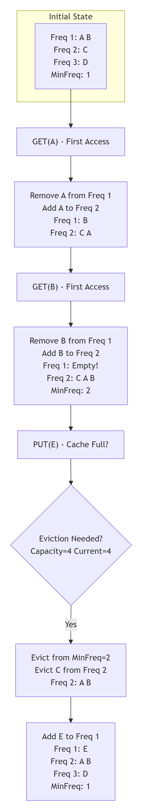
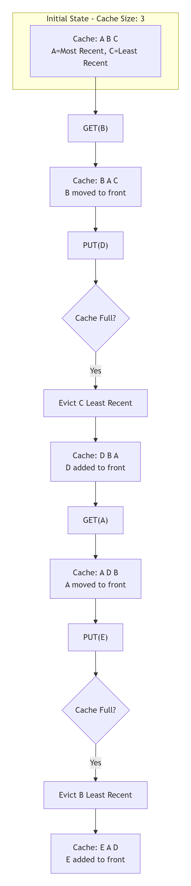

**Caching** is a technique that stores frequently accessed data in a **fast-access storage layer** to reduce latency and improve performance.

### **Why Cache?**
```
Without Cache:    User Request → Database (Slow) → Response (200-500ms)
With Cache:       User Request → Cache (Fast) → Response (5-20ms)
                                 ↓ (if not found)
                              Database → Store in Cache
```

## **LRU Cache (Least Recently Used)** {#lru-cache}

### **How It Works**
```
Concept: "If you haven't used it recently, you probably won't need it soon"

Data Structure:
- Hash Map (Dictionary) for O(1) lookups
- Doubly Linked List for O(1) reordering

Operations:
1. GET(key): Move item to front (most recent)
2. PUT(key, value):
   - If exists: Update value, move to front
   - If full: Remove tail (least recent), add to front
```

### **When to Use LRU:**
1. **Browser Cache**
2. **Operating System Page Cache**
3. **Database Query Cache**
4. **Session Management**
5. **API Response Caching**


## ** LFU Cache (Least Frequently Used)** {#lfu-cache}

### **How It Works**
```
Concept: "If you haven't used it much, you probably don't need it"

Data Structure:
1. Hash Map: key → (value, frequency, node)
2. Frequency Map: frequency → Doubly Linked List
3. Min Frequency tracker

Operations:
1. GET(key): Increase frequency, move to next freq list
2. PUT(key, value):
   - If exists: Update value, increase frequency
   - If full: Remove from min frequency list
```

### **When to Use LFU:**
1. **Content Delivery Networks (CDN)**
2. **Search Engine Results**
3. **E-commerce Product Catalog**
4. **Advertisement Serving**
5. **Compiler Optimization**

---

### **Quick Reference:**

| **Choose LRU When:** | **Choose LFU When:** |
|----------------------|----------------------|
| • Recent access matters | • Frequency matters |
| • Sequential patterns | • Stable access patterns |
| • Memory constrained | • Can tolerate memory overhead |
| • Simple implementation needed | • Popular content needs to stay |


---
### **LFU Life cycle Example:**



---
---

### **LRU Life cycle Example:**


